## Overview

The **Enhanced SQL Chatbot** is an intelligent application that bridges the gap between natural language and SQL databases. Built with cutting-edge AI technology, it allows users to interact with their databases using plain English, making data analysis accessible to everyone.

### What Makes It Special?

- **AI-Powered**: Leverages Groq's lightning-fast LLM for instant query translation
- **Natural Language**: Ask questions in plain English, get SQL results
- **Multi-Database**: Supports SQLite and MySQL seamlessly
- **Real-time**: Interactive chat interface with instant responses
- **Smart Preview**: Database schema exploration and sample data viewing

## Key Features

| Feature | Description |
|---------|-------------|
| **Natural Language Processing** | Ask questions in plain English and get accurate SQL responses |
| **Multi-Database Support** | Compatible with SQLite (local) and MySQL (remote) databases |
| **Groq LLM Integration** | Powered by `llama-3.3-70b-versatile` for high-speed reasoning |
| **Interactive Chat Interface** | Streamlit-based real-time conversation experience |
| **Database Schema Preview** | View tables and sample data directly from the UI |
| **Query History Tracking** | Store and review previous queries for quick access |
| **Performance Optimization** | Streamlit resource caching for efficient reconnections |
| **Robust Error Handling** | Graceful fallback for invalid connections or failed queries |

## Tech Stack

<div align="center">

| Category | Technology | Purpose |
|----------|------------|---------|
| **Frontend** | [Streamlit](https://streamlit.io/) | Interactive web interface |
| **AI Engine** | [Groq LLM](https://groq.com/) | Natural language processing |
| **Framework** | [LangChain](https://langchain.com/) | AI agent orchestration |
| **Database** | SQLite, MySQL | Data storage and retrieval |
| **ORM** | [SQLAlchemy](https://sqlalchemy.org/) | Database connectivity |
| **Language** | Python 3.10+ | Core development |

</div>

## Quick Start

### Prerequisites
- Python 3.10 or higher
- [Groq API Key](https://console.groq.com/)
- SQLite database (included) or MySQL server

### Installation

1. **Clone the repository**
   ```bash
   git clone https://github.com/Aarif-Mir/langchain-sql-chatbot.git
   cd langchain-sql-chatbot
   ```

2. **Create virtual environment** (recommended)
   ```bash
   python -m venv venv
   venv\Scripts\activate     # On Windows
   ```

3. **Install dependencies**
   ```bash
   pip install -r requirements.txt
   ```

4. **Set up database**
   
   **For SQLite (default):**
   ```bash
   python sqlite.py  # Creates sample student.db
   ```
   
   **For MySQL:**
   - Ensure MySQL server is running
   - Have credentials ready (host, user, password, database)

5. **Run the application**
   ```bash
   streamlit run app.py
   ```

6. **Access the app**
   - Open your browser 
   - Enter your Groq API key in the sidebar
   - Select your database type
   - Start chatting!

## Usage Examples

### Sample Queries

| Natural Language Query | SQL Translation |
|------------------------|-----------------|
| `"List all students in section A"` | `SELECT * FROM STUDENT WHERE SECTION = 'A'` |
| `"Find students studying Machine Learning"` | `SELECT * FROM STUDENT WHERE CLASS = 'Machine Learning'` |
| `"Display students with marks above 80"` | `SELECT * FROM STUDENT WHERE MARKS > 80` |
| `"Identify the student with highest marks"` | `SELECT * FROM STUDENT ORDER BY MARKS DESC LIMIT 1` |

## Project Structure

```
enhanced-sql-chatbot/
│
├── app.py                  # Main Streamlit application
├── student.db             # Sample SQLite database
├── requirements.txt        # Python dependencies
├── sqlite.py              # Database setup script
├── README.md              # Project documentation
├── logs/                  # Application logs
└── assets/               # Static assets (if any)
```

## Architecture Overview

```mermaid
graph TD
    A[👤 User Input] --> B[🎨 Streamlit UI]
    B --> C[🔍 Input Validation]
    C --> D[🧠 Groq LLM]
    D --> E[🔗 LangChain Agent]
    E --> F[🗄️ Database]
    F --> G[📊 Results Display]
    G --> H[📜 Query History]
```



### Component Flow

1. **User Interface**: Streamlit-based chat interface with sidebar configuration
2. **Validation Layer**: API key validation and database connection verification
3. **AI Processing**: Groq LLM translates natural language to SQL
4. **Agent Orchestration**: LangChain SQL agent executes queries
5. **Data Layer**: SQLAlchemy handles database connectivity
6. **Response Rendering**: Formatted results with interactive tables
7. **History Management**: Query logging and session state management

## 🔧 Configuration

### Environment Variables
```bash
GROQ_API_KEY=your_groq_api_key_here
```

### Database Configuration
- **SQLite**: Uses local `student.db` file
- **MySQL**: Requires connection details in sidebar

## 📝 Important Notes

- 🧠 **Model**: Uses `llama-3.3-70b-versatile` via Groq API
- 🗄️ **Database**: Includes sample student database with 5 records
- 🔒 **Security**: API keys are handled securely through Streamlit
- ⚡ **Performance**: Implements caching for efficient reconnections
- 🛡️ **Error Handling**: Comprehensive error management and user 

## 📄 License

This project is licensed under the Apache License 2.0 - see the [LICENSE](LICENSE) file for details.

## 🙏 Acknowledgments

Special thanks to:
- **[Krish Naik](https://github.com/krishnaik06)** for educational guidance and inspiration in AI-powered SQL automation
- **[LangChain](https://langchain.com/)** team for the amazing framework
- **[Groq](https://groq.com/)** for providing lightning-fast LLM inference

---
